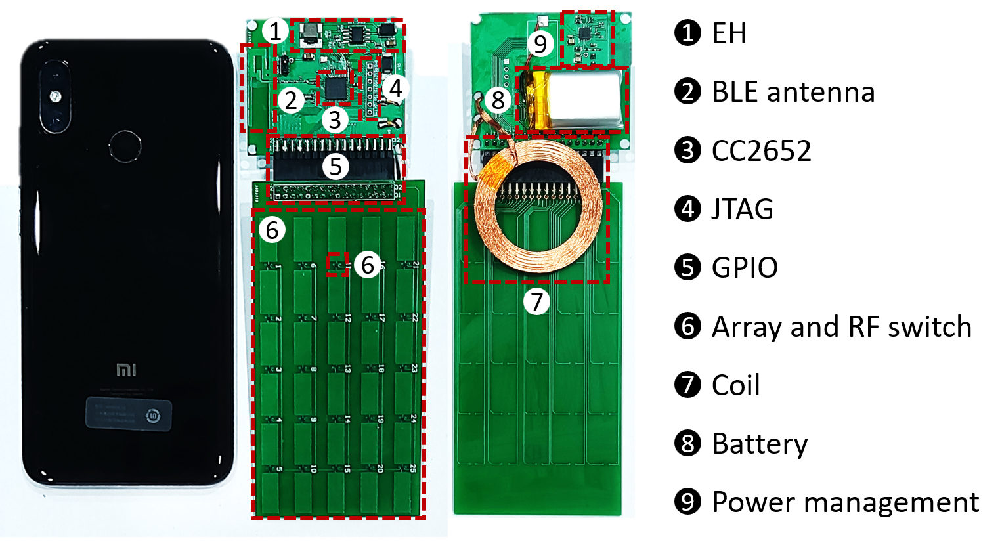

# SmartShell

This project contains the SmartShell hardware design and source code of wireless configuration and SmartShell APP.

The source code of wireless configuration should be compiled by TI Code Composer Studio 12.1.0. The source code of the SmartShell APP should be compiled by Android Studio 2021.3.1.17.

## Overview

SmartShell use a small-sized and low-cost reflective surface attached to the mobile device to program the micro-environment of radio propagation near the device. The system consists of five main parts:(1)The array optimization algorithm running in the SmartShell APP installed on the mobile device.(2)The Wi-Fi RSSI collection thread running in the mobile device that calls system function to measure real-time RSSI values and put them to the optimization algorithm as the feedback. (3)The antenna array which accepts the MCU commands to control each element's impedance.(4)The BLE configuration mechanism that conveys the array control commands genreated by the mobile device to the MCU.(5)An energy harvesting circuit that provides energy for the SmartShell hardware independent of the mobile device. Here parts (1) and (2) are integrated into a single SmartShell APP.

## Hardware

SmartShell hardware contains two parts: a board with MCU and energy harvesting module and an antenna array board. When you use SmartShell, you should connect the two parts by pin header and female header. The PCB hardware is designed using Altium Designer 19. You can download the schematics as well as the layout files in this project. Before SmartShell is powered up, it should check if the battery is still functional. If not, the battery needs to be charged via the coil energy harvesting.

## Software 

The subdirectory software contains the source code of wireless configuration (MCU folder) and the source code of SmartShell APP (APP folder). （https://github.com/oymingw/SmartShell）

**Wireless Configuration**

We use BLE as the wireless technique where Bluetooth's Generic Access Profile (GAP) is used to control device connections and broadcasts. The low power Bluetooth connection is based on the GATT protocol, which defines the way two Bluetooth low power devices transfer data back and forth using a concept called Service and Characteristic. It should use TI CCS to compile the source code of wireless configuration. In addition, it should install SimpleLink-CC13X2-26X2-SDK 4.20.01.04 so that it can compile successfully. 

**SmartShell APP**

We write an Android APP that collects RSSI data every 100ms to accommodate the QS algorithm. It should use Android Studio 2021.3.1.17 to install the APP into Android phone. In order to ensure that the APP can be installed into the Android phone, it need to open the Android phone's developer rights.

## Main Contributors

Linling Zhong (uranium_zll@sjtu.edu.cn)

Ouyang Mingwei (1999mrou@sjtu.edu.cn) 

Fengyuan Zhu (jsqdzhufengyuan@sjtu.edu.cn)

